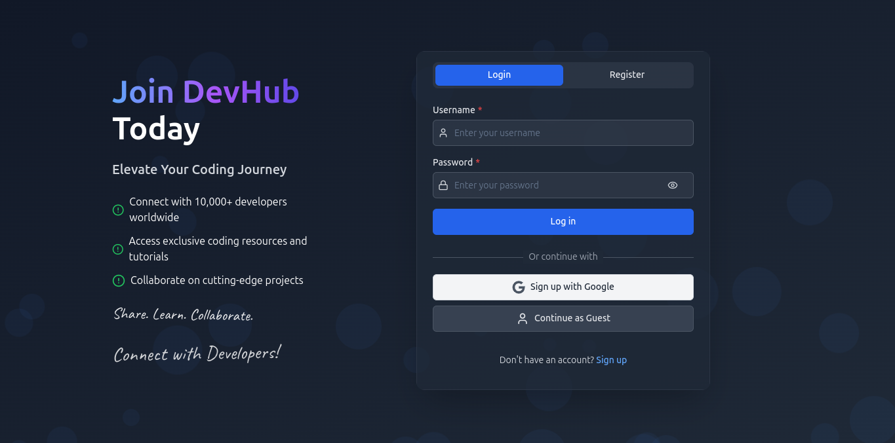

# DEVHUB
>#### *Share. Learn. Collaborate. Connect with Developers!*


<br>

---

<br>

# **Setup**
## *Backend*
``` shell
# Navigate to backend directory
cd backend

# Create a python virtual environment(venv)
python -m venv .venv

# Activate your virtual environment:
source .venv/bin/activate

# Install dependencies
python install -r requirements.txt

# Setup flask
flask db migrate
flask db update

# Spin the backend
python main.py
```
> Copy the backend server url ex: ```http://127.0.0.1:5000``` 

## *Frontend*
```shell
# Navigate to frontend directory(now you're in devhub/backend)
cd ../frontend

# Setup the .env file
echo VITE_API_URL=http://127.0.0.1:5000 >> .env # replace the url with the one you copied

# Install dependencies
npm i

# Spin the frontend
npm run dev
```